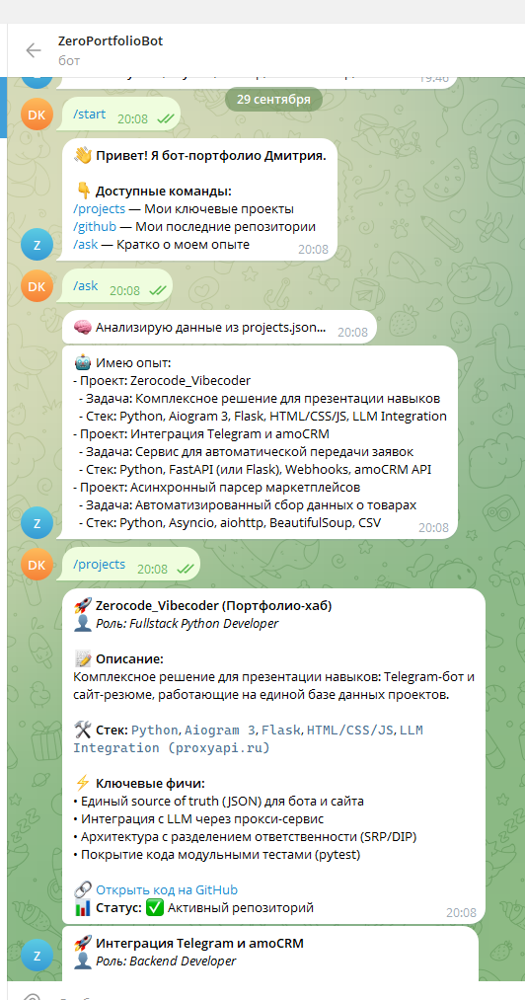
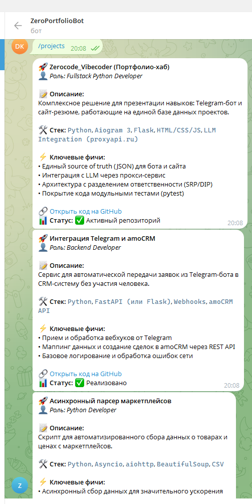
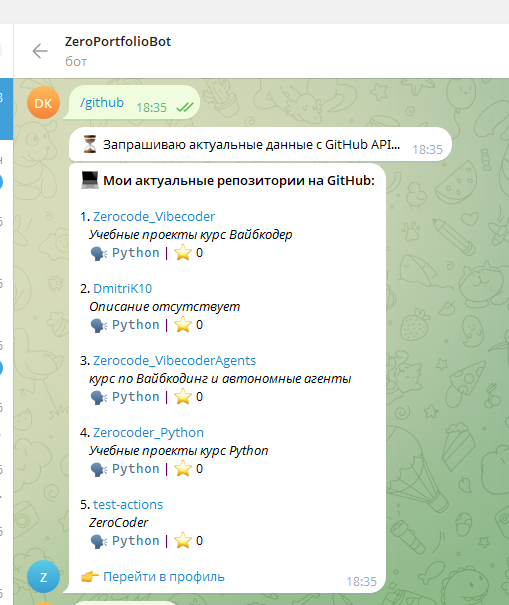

# Portfolio Telegram Bot

Промышленный Telegram-бот для демонстрации портфолио Python-разработчика.  
Проект написан на **Python (aiogram 3)** с строгим соблюдением принципов **SRP** (Single Responsibility Principle) и **DIP** (Dependency Inversion Principle). Реализована устойчивая интеграция с LLM через прокси-сервис (`proxyapi.ru`) с обработкой сетевых ошибок (Graceful Degradation).

## 🛠 Стек технологий

- **Python 3.11+**
- **aiogram 3** (Асинхронный фреймворк для Telegram Bot API)
- **httpx** (Современный асинхронный HTTP-клиент)
- **pytest** + **pytest-asyncio** (Модульное тестирование с проверкой краевых случаев)
- **python-dotenv** (Безопасное управление переменными окружения, ключи не хранятся в коде)

## 📂 Архитектура проекта

Проект имеет четкое разделение ответственности (SRP) и зависит от абстракций (DIP):
- `main.py` — Точка входа, инициализация зависимостей и динамическое определение абсолютных путей (`Path(__file__).parent.resolve()`).
- `src/interfaces.py` — Абстракции (интерфейсы) для инверсии зависимостей.
- `src/repository.py` — Слой доступа к данным (чтение `projects.json`).
- `src/ai_service.py` — Интеграция с LLM через прокси с перехватом исключений.
- `src/bot_handlers.py` — Слой представления (логика ответов бота, безопасный HTML-рендеринг).
- `src/github_service.py` — Сервис для получения актуальных данных из GitHub REST API.
- `tests/` — Модульные тесты, покрывающие как успешные сценарии, так и краевые случаи (ошибки сети, невалидный JSON).

## ⚡ Функционал и команды бота

- `/start` — Приветственное сообщение и справка по командам.
- `/projects` — Демонстрация ключевых проектов с описанием, стеком и ссылками (данные берутся из `projects.json`).
- `/github` — Получение актуальных репозиториев разработчика в реальном времени через GitHub API.
- `/ask` — Формирование сухого, фактологического ответа о навыках на основе реальных данных проектов с помощью LLM (исключены галлюцинации за счет строгого системного промпта).

## 📸 Демонстрация работы (Скриншоты)

| Команда `/projects` | Команда `/github` | Команда `/ask` |
| :---: | :---: | :---: |
|  |  |  |

*(Если изображения не отображаются, убедитесь, что вы просматриваете README на GitHub, а пути к файлам в репозитории сохранены)*

## 🔗 Доступы и статус

- **Ссылка на бота:** [@ZeroPortfolioBot](https://t.me/ZeroPortfolioBot) @ZeroPortfolioBot*
- **Исходный код:** [github.com/DmitriK10/Zerocode_Vibecoder](https://github.com/DmitriK10/Zerocode_Vibecoder)
- **Статус проекта:** ✅ Завершён, готов к демонстрации и дальнейшему расширению.

## 🚀 Инструкция по запуску (Windows)

1. **Откройте PowerShell** в корне папки `PortfolioBot`.
2. **Создайте и активируйте виртуальное окружение:**
   ```powershell
   python -m venv venv --upgrade-deps
   .\venv\Scripts\Activate.ps1